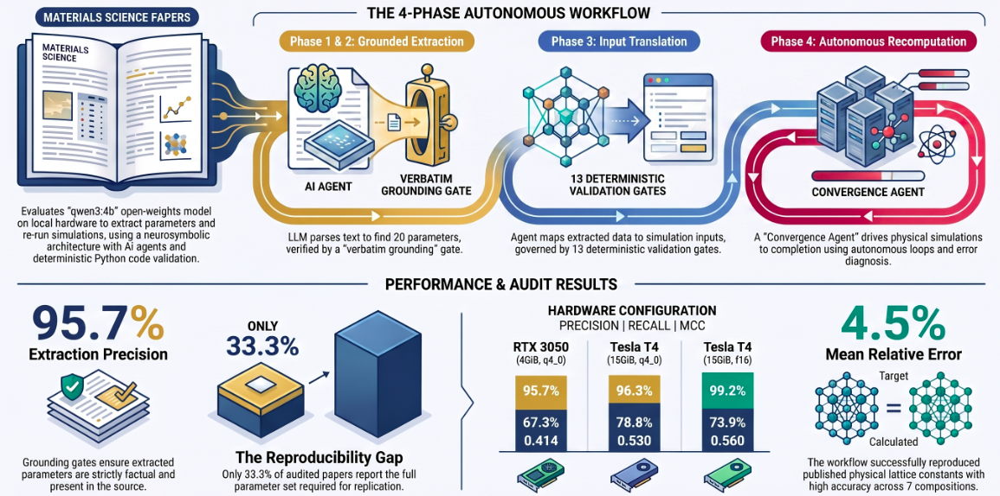

# Evaluating a 4B open-weights local LLM for agentic DFT workflows: a literature reproducibility audit

[](https://github.com/shambhubhandari/Agentic-Workflow/actions/workflows/ci.yml)
[](https://opensource.org/licenses/MIT)
[](https://creativecommons.org/licenses/by/4.0/)
[](https://www.python.org/)
[](https://ollama.com/library/qwen3)
[](https://ollama.com/)
[](https://siesta-project.org/)
[](#quick-start)

**Repository for the study** *"Evaluating a 4B open-weights local LLM for agentic DFT workflows: a literature reproducibility audit"* — a pipeline that reads published first-principles papers on
pentagonal 2D monolayers, extracts the method each one used, and re-runs in SIESTA what
can be re-run, entirely on local, open-weights models. Computed over a frozen 298-record
OpenAlex query, 69 retrieved full texts, and 25 hand-labelled papers carrying 201 expert
judgements.



## Quick start

```bash
make env                                               # Python 3.11+, .venv, editable install
source .venv/bin/activate
make values                                            # recompute every reported value
make notebook                                          # launch interactive data exploration notebooks
```

Non-zero exit if any registered value disagrees with what the artefacts produce.

## Repository Architecture

```
Publication_repo/
├── src/acv/
│   ├── pipeline/               # corpus, fetch, extract, evaluate, calibrate, report
│   ├── crews/                  # translator, convergence, diagnostician, critic
│   ├── executors/              # local.py — SIESTA under mpirun
│   ├── flows/                  # verification flow and its state
│   ├── guardrails/             # epistemic bounds, resource limits
│   ├── hooks/                  # provenance and audit logging
│   ├── knowledge/              # SIESTA index, prototypes, literature
│   ├── verification/           # recompute functions behind the registry
│   ├── visualization/          # figure generators
│   └── prompts/                # extraction prompts, versioned
├── data/
│   ├── raw/
│   │   ├── corpus/corpus_298_locked.jsonl     # the frozen query — do not re-run
│   │   ├── labels_expert/                     # hand annotations, not regenerable
│   │   ├── labels_model/                      # second-rater model labels
│   │   ├── prototypes/                        # pentagonal structure templates
│   │   ├── fulltext_manifest.tsv              # DOI, URL, SHA-256 of all 69 documents
│   │   └── reported_values.yaml               # the registry — 40 entries
│   ├── external/pseudopotentials/             # the exact .psml files used
│   ├── interim/extraction/                    # three gated passes, per configuration
│   └── processed/                             # evaluation, calibration, parity, evidence
├── notebooks/                  # interactive manuscript-grade data exploration
│   ├── 01_raw_data_exploration.ipynb          # raw corpus, manifest, expert labels, raters
│   ├── 02_extraction_exploration.ipynb        # extraction campaigns, reporting gaps, stability
│   └── 03_processed_data_exploration.ipynb    # verification report, SIESTA parity, LaTeX audit
├── configs/                    # corpus, models, tier0, tier2 — the tuned values
├── scripts/                    # verify.py, score_labels.py, fetch_fulltext.py, …
├── setup/                      # 00-system → 40-verify, fresh-machine provisioning
├── figures/                    # generated figures, named for content
├── tests/unit/                 # gate behaviour, agent bounds, calibration, extraction
└── Makefile                    # make help
```

## Models and Methods

The pipeline is fully local: no hosted model is called at any point.

**Language model**

- `qwen3:4b` (Q4_K_M, ~2.5 GB, Apache 2.0), served by Ollama on `localhost`
- Temperature 0.0, `num_predict` 2048, context bucketed between 4k and 32k tokens
- KV cache quantisation is a measured variable, not a detail — `q4_0` and `f16` give
  different accuracy (MCC 0.414 → 0.560) and different VRAM floors (3.61 → 6.44 GiB)

**Extraction and gating**

- Three independent passes per paper, unioned and then gated
- Grounding: every extracted field must be locatable in the source text
- Value support: numeric claims re-checked against the text, with unit normalisation

**Agent crews**

- Translator — paper's stated method into SIESTA input
- Convergence — drives the mesh/k-point/threshold loop
- Diagnostician — classifies a failed calculation
- Critic — reviews a finished calculation before a verdict is written

**First-principles verification**

- SIESTA under MPI, with the pseudopotentials shipped in `data/external/`
- 8 axis-matched lattice comparisons; MAE 0.110 Å, MARE 2.3 %
- Verdicts describe the recomputation, never the paper. There is deliberately no outcome
  meaning "verified" or "refuted"

## Scope

This repository does not reimplement the papers it audits. It reproduces its own
published pipeline over frozen artefacts, and separates what the extractor found from how
far that finding can be trusted.

**Two populations, and they are not interchangeable.**

```
audited-corpus     298 frozen query
                 →  69 full text retrieved      ← pipeline runs, pass stability
                 →  62 extracted
                 →  57 audited                  ← reporting completeness

expert-labels      27 hand-labelled papers
                 →  25 with a scorable decision ← ALL accuracy figures
                 → 201 judgements
```

Every precision, recall, F1 and MCC value is computed over the 25 hand-labelled papers —
never over the 69 or the 57. `make values` groups its report by population for this
reason, and every registry entry carries a `population:` field.

**Deliberately absent.** The manuscript itself, because a code repository is not where a
paper belongs; the registry carries the numbers instead. Article full text, because
publisher documents are not ours to redistribute — `make fulltext` fetches and
hash-verifies them against the manifest, and the three registry entries that need source
text report `NEEDS-FULLTEXT` rather than failing until it is present. SIESTA run
directories, ~77 MB of regenerable scratch, distilled into
`data/processed/parity_points.jsonl`.

**Re-running the pipeline** needs a GPU, an Ollama server, SIESTA and the article text. Run `make check` to report what resources this machine has.

## Acknowledgements

This audit is possible only because the authors of the papers it reads published enough
method to be re-run at all, and because the corpus was assembled from
[OpenAlex](https://openalex.org/). It builds on
[SIESTA](https://siesta-project.org/) for the first-principles work, on
[Ollama](https://ollama.com/) and the openly licensed
[Qwen3](https://github.com/QwenLM/Qwen3) weights for local inference, and on the
ONCVPSP-generated `.psml` pseudopotentials shipped under `data/external/`.

## License

Code is MIT (`LICENSE`). Data is CC-BY-4.0 (`LICENSE-DATA`), covering everything under
`data/`, including the expert label set. Cite via `CITATION.cff`.
